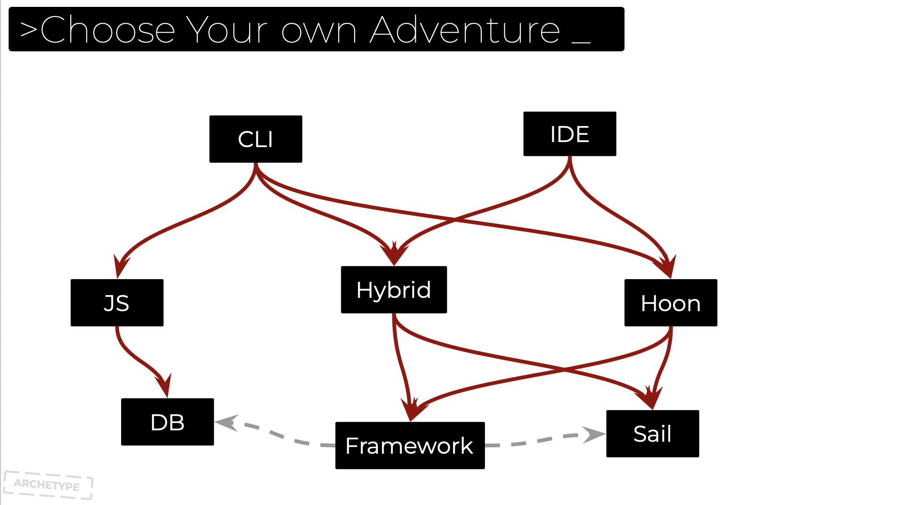
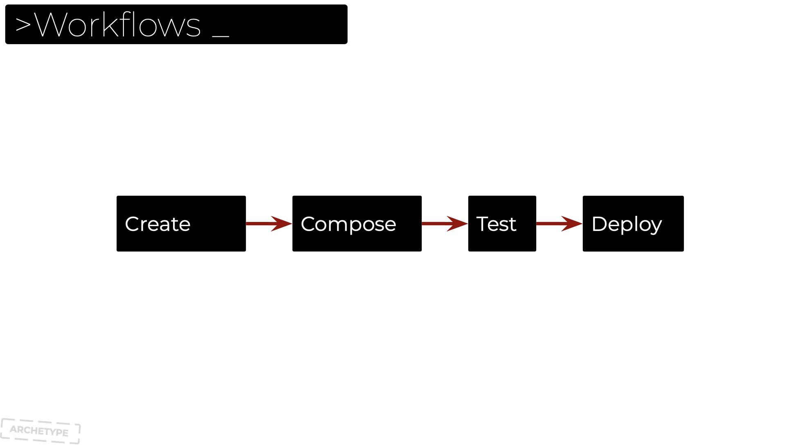
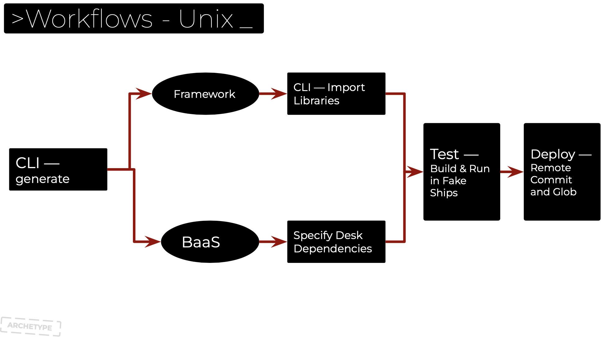
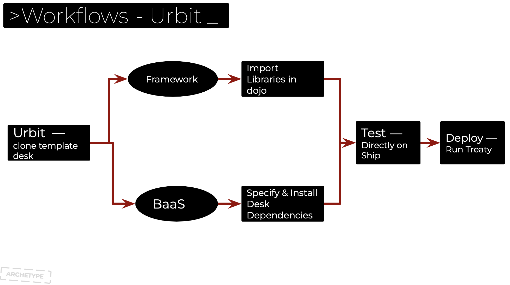
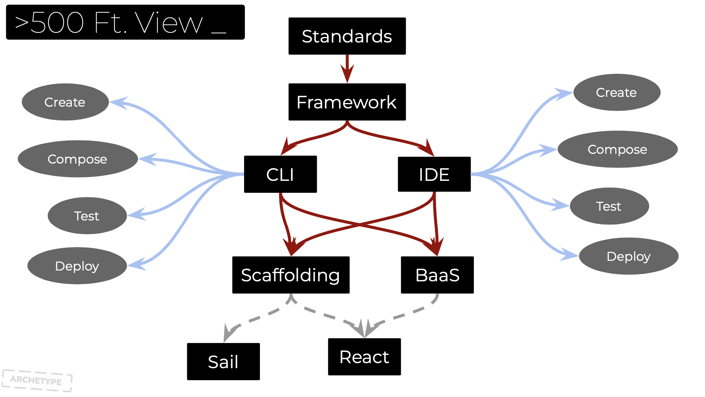
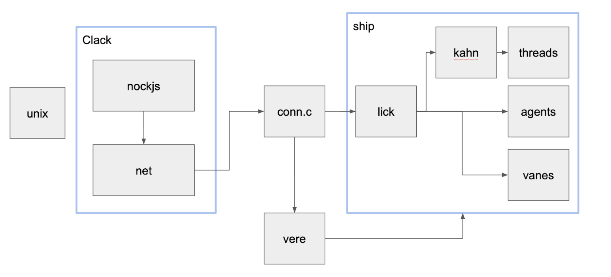
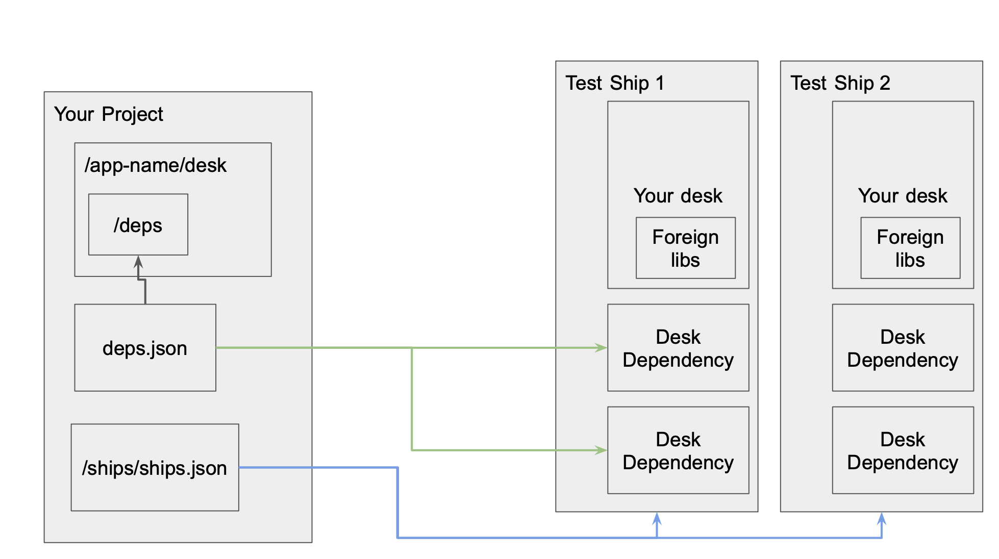
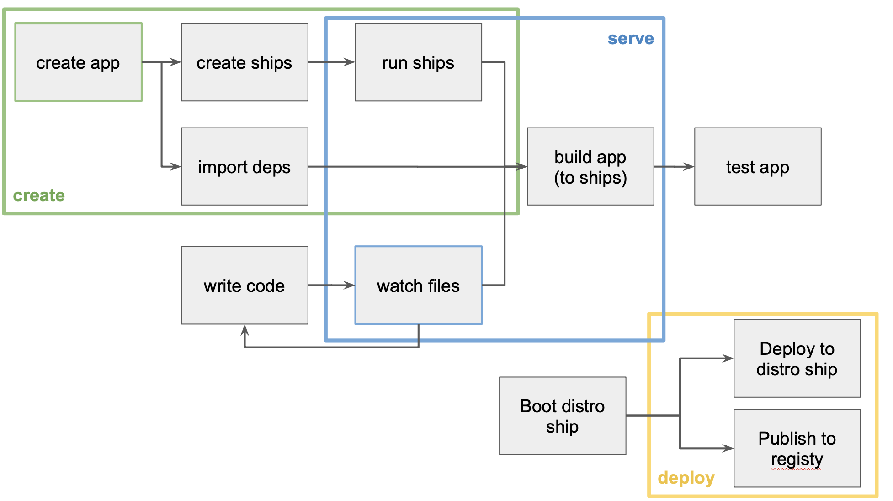
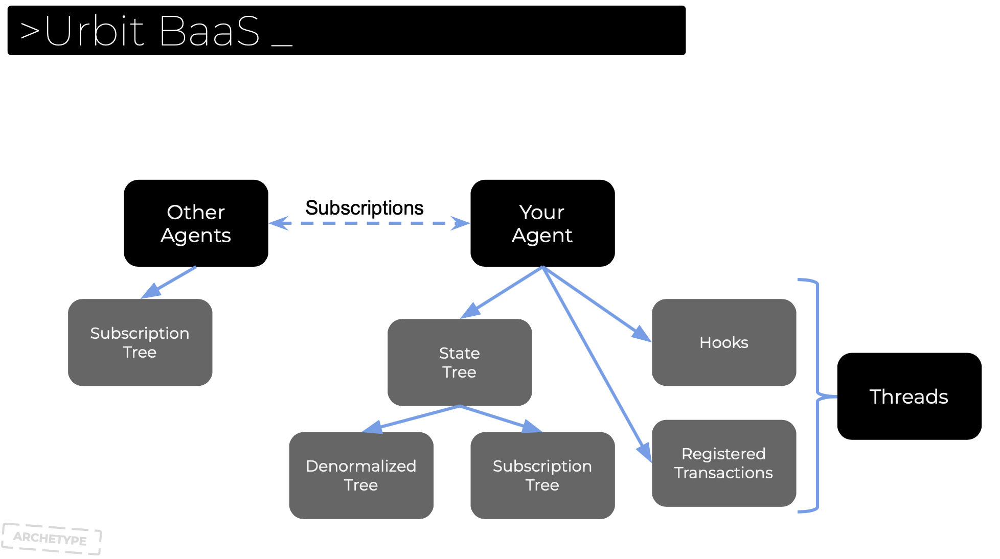

# Proposal: %loam — Golem + Urbit Dev Suite Grab Bag

## Elevator Pitch
In order to terraform mars, urbit will need a rich soil to grow its software both from urth and mars. In other words, it needs %loam — a loosely-coupled set of opinionated standards and dev tools that connect the existing software and tooling into a cohesive and consistent model, so that apps being built in different parts of the terrain are more inter-navigable, and interoperable.

# Overview

## Purpose

The loam proposal is slightly non-standard. Rather than proposing a single specific piece of software with sequential milestones, this document describes a "grab bag" of useful developer tools that can be built in any order or even in parallel. We are consolidating them here for ease of review, as well as to show how they are loosely united under a common initiative. 

The main goals of these standards and tools are to make Urbit development more:
1. **Cohesive** — It should be easy and painless to have all of the state-of-the art dev tools in your Ubrit projects out of the box, and working together
2. **Consistent** — Piping between dev tools should be consistent across different projects, it should be effortless to implement best practices when starting your projects, so that devs from other projects can open it up and immediately understand what is going on

## Scope

Here is a shortlist of things that need to be solved for this goal:

* Project Creation 
* Code Scaffolding for Hoon
* An opinionated framework for Hoon
* Binary Management
* Package/Dependency Management
* Standardized Deployment Pipeline
* Urth-side livereload
* Urth -> Mars Message passing
* IAC (Infrastructure as Code) For Dev Envs
* A drop-in solution for NoSQL Data 
* DID Resolution

You should be able to take advantage of these things — \
— whether you are developing in mars or urth, \
— whether you are building in javascript or hoon or a mixture of the two, and \
— whether you are building a generator, agent, or webapp. 

This allows for flexibility where it is important to devs while providing opinions and standards for the things that get overlooked and take up development time when creating new projects and companies. 

In order to facilitate this, there are a few different things that need to be built:
1. **CLI (golem)** — and urth-side CLI for project creation, scaffolding, and binary & dependency management
2. **Dojo Tool/IDE** — a desk of threads and opinionated pill for project creation, scaffolding, and binary & dependency management in mars. 
3. **JS IPC LIbrary (clack)** — a js wrapper around conn.c to make your fakeships scriptable from JS on MacOS
4. **BaaS** — a desk for a NoSQL Store that can be used as a BaaS, allowing JS-first developers to move business logic to the frontend
5. **Package Manager** — an urbit instance of an [Egyn]() registry for managing packages, binaries, and other urbit artefacts, as well as a GUI to browse them
6. **DID Resolver** — <what actaully is this>

In addition, there are some integrations that don't fit neatly into one of these projects, included in this document as well. 

The Second part of this proposal doc will go into each of these in more detail. First we will paint a 500 ft view of how these fit together into a consistent workflow.

## Workflow

The goal of providing these tools is to free up developer time and creativity from reimplementing the piping between layers of an app all the time, as well as to standardize key steps in the SDLC for urbit so that primitives being built and shared loosely conform to legible conventions. Namely, it should be trivial to create, compose, test, and deploy/publsih an app from your local environment, wether on Urth or Mars.

This process can be broken down further for both urth and mars development as seen below:

These diagrams highlight where the steps of the SDLC require different tooling from different environments, while still preserving the ability to have one set of best practices and project structure within a given app. 

Here is a 500 Foot view of how the these fit together from end to end:

# Design and implementation

## clack — Design

### User Segments

* JS developer

### User Stories

1. As a JS Dev, I need to be able to send %peel messages to conn.c, so that I can assess the state of my fake ships from outside
2. As a JS Dev, I need to be able to send %ovum messages to conn.c, so that I can script kernel updates into my fake ships
3. As a JS Dev, I need to be able to send %fyrd messages to conn.c, so that I can trigger threads in my fake ships
4. As a JS Dev, I need to be able to send %urth messages to conn.c, so that I can trigger threads in my fake ships
5. As a JS Dev, I need to be able to send %peek messages to conn.c, so that my tests can get state from my agents from outside urbit, without using the network
6. As a JS Dev, I need to be able to use self-documenting method names to make these calls, so that I can start using urbit tooling before i finish learning hoon/nouns
7. As a JS Dev, I need to be able to rely on the client to jam/newt encode my input, so that I can continue using objects/methods in my code

### Engineering Design

## golem — Design

Golem is a  CLI for creating projects, managing dependencies, running a test env, and publishing your app. It uses a templating system to create new projects and add scaffolding to existing ones, emphasizing IAC in order to preserve consistency and allow teams to iterate on best practices for common activities in an urbit app. It manages both code dependencies (think /lib/mydep.hoon) as well as desk dependencies. The structure of the projects and test envs are included in the engineering designs of this section, as well as a diagram of which low-level interactions are handled at each step.

### Segments

* Urbit developer

### Stories

#### Creation

* As an Urbit Dev, I need to be able to create urbit projects from unix, so that I don't need to set them up manually every time
* As an Urbit Dev, I need to be able to create a project with react, so that I can build my UI in JS
* As an Urbit Dev, I need to be able to create a project with sail, so that I can build a UI in Hoon
* As an Urbit Dev, I need to be able to create an empty project, so that I can set up a custom front end and desk with my preferred tooling

Scaffolding

* As an Urbit Dev, I need to be able to generate a crud interface (mark, sur, lib, etc), so that I can add a data type to my app in a consistent way
* As an Urbit Dev, I need to be able to generate sail pages and components, so that I can build modular UIs in Hoon without manually setting them up
* As an Urbit Dev, I need to be able to generate library files, so that I can move my reusable logic into an easily packageable format
* As an Urbit Dev, I need to be able to generate threads for accessing external APIs, so that I can contain my interactions with stateful APIs outside of urbit
* As an Urbit Dev, I need to be able to generate generators, so that I can write custom tooling and scripts for my project
* As an Urbit Dev, I need to be able to extend scaffolding, so that I can write custom generators for my team's preferred way of doing things

#### Running

* As an Urbit Dev, I need to be able to run my project in a managed fakeship, so that I can test it
* As an Urbit Dev, I need to be able to livereload my fakeship when changes are saved, so that I can see the updates
* As an Urbit Dev, I need to be able to build and send my /ui folder to glob, so that I can iterate on the UI design from react

#### Binary and Package Management pt. I

* As an Urbit Dev, I need to be able to get the right binaries at the time of project creation, so that I don't have to find and install them manually
* As an Urbit Dev, I need to be able to get the latest versions of %base and %garden at the time of project creation, so that I don't have to find and install them manually
deployment pipeline
* As an Urbit Dev, I need to be able to log in to a moon/ship locally, so that I can interact with my distro ship
* As an Urbit Dev, I need to be able to install an app from my local ship to my distro ship, so that I can make it available for users
* As an Urbit Dev, I need treaty to be run treaty on deployed apps by default, so that they are available once published
* As an Urbit Dev, I need to be able to publish my libraries to the registry, so that they can be reused by other contributors as a code dependency
* As an Urbit Dev, I need to be able to publish my desk to the registry, so that they can be reused by other contributors as a des dependency

#### Creation Pt. II

* As an Urbit Dev, I need to be able to create a project with a %lick connection set up, so that I can build a IOT app with the same standards as my other projects
* As an Urbit Dev, I need to be able to create a project with a shoe.hoon set up, so that I can build a CLI app with the same standards as my GUI projects
* As an Urbit Dev, I need to be able to create a project with phaser.io as the glob, so that I can build a HTML5 game for urbit
* As an Urbit Dev, I need to be able to create a project with aframe.js as the glob, so that I can build a HTML5 game for urbit

#### Running Pt. II

* As an Urbit Dev, I need to be able to provision multiple fakeships, so that I can test interactions between instances of the same agent
* As an Urbit Dev, I need to be able to provision fakeships with specific desks, so that I can test interactions between different desks that have dependencies
* As an Urbit Dev, I need to be able to rebuild all my fakeships, so that I can hard reset my test environment

#### Package Management Pt. II

* As an Urbit Dev, I need to be able to search packages on the registry by name, so that I can find if it has what I need
* As an Urbit Dev, I need to be able to install a package from the registry, so that I can find reuse the code
* As an Urbit Dev, I need to automatically be given a packages dependencies, so that I don't need to link them manually
* As an Urbit Dev, I need to be able to uninstall a package from the registry, so that I can remove vulnerabilities/surface area from my application

### Engineering Design

Here is a model of the project and test env structure of golem:

This diagram shows what low-level operations are run on your project or test fleet, when using the commands `create`, `serve`, and `deploy` respectively:

Ultimately, golem is the place from where you run the unix-side SDLC for an urbit app (as shown above):

### UI/UX Design

* NA

## Dojo Tools — Design

We will also need a set of generators and threads for use in dojo, that mirror the functionality of some of golem's functions. Ultimately the high level steps will be the same, although some of the details of the project structure will change, in the scenario where you are using a long-lived fakeship for development rather than a fleet.

### Segments

* hoon developer

### Stories

Creation
* As a Hoon Dev, I need to be able to create a project with react, so that I can build my UI in JS
* As a Hoon Dev, I need to be able to create a project with sail, so that I can build a UI in Hoon
Scaffolding
* As a Hoon Dev, I need to be able to generate a crud interface (mark, sur, lib, etc), so that I can add a data type to my app in a consistent way
* As a Hoon Dev, I need to be able to generate sail pages and components, so that I can build modular UIs in Hoon without manually setting them up
* As a Hoon Dev, I need to be able to generate library files, so that I can move my reusable logic into an easily packageable format
* As a Hoon Dev, I need to be able to generate threads for accessing external APIs, so that I can contain my interactions with stateful APIs outside of urbit
* As a Hoon Dev, I need to be able to generate generators, so that I can write custom tooling and scripts for my project
* As a Hoon Dev, I need to be able to extend scaffolding, so that I can write custom generators for my team's preferred way of doing things
Running
* As a Hoon Dev, I need to be able to build and send my /ui folder to glob, so that I can iterate on the UI design from react
  binary and package mgmt pt. I
* As a Hoon Dev, I need to be able to get the latest versions of %base and %garden at the time of project creation, so that I don't have to find and install them manually
  deployment pipeline
* As a Hoon Dev, I need to be able to get perms for my distro ship, so that I can interact with it
* As a Hoon Dev, I need to be able to install an app from my current ship to my distro ship, so that I can make it available for users
* As a Hoon Dev, I need treaty to be run treaty on deployed apps by default, so that they are available once published
* As a Hoon Dev, I need to be able to publish my libraries to the registry, so that they can be reused by other contributors as a code dependency
* As a Hoon Dev, I need to be able to publish my desk to the registry, so that they can be reused by other contributors as a des dependency
  Creation Pt. II
* As a Hoon Dev, I need to be able to create a project with a %lick connection set up, so that I can build a IOT app with the same standards as my other projects
* As a Hoon Dev, I need to be able to create a project with a shoe.hoon set up, so that I can build a CLI app with the same standards as my GUI projects
* As a Hoon Dev, I need to be able to create a project with phaser.io as the glob, so that I can build a HTML5 game for urbit
* As a Hoon Dev, I need to be able to create a project with aframe.js as the glob, so that I can build a HTML5 game for urbit
  Running Pt. II
* As a Hoon Dev, I need to be able to provision multiple fakeships, so that I can test interactions between instances of the same agent
* As a Hoon Dev, I need to be able to provision fakeships with specific desks, so that I can test interactions between different desks that have dependencies
* As a Hoon Dev, I need to be able to rebuild all my fakeships, so that I can hard reset my test environment
  Package mgmt pt. II
* As a Hoon Dev, I need to be able to search packages on the registry by name, so that I can find if it has what I need
* As a Hoon Dev, I need to be able to install a package from the registry, so that I can find reuse the code
* As a Hoon Dev, I need to automatically be given a packages dependencies, so that I don't need to link them manually
* As a Hoon Dev, I need to be able to uninstall a package from the registry, so that I can remove vulnerabilities/surface area from my application

### Engineering Design

Here is how the SDLC differs for dojo/mars:

## BaaS — Design

The BaaS agent will let frontend developers use their desk as a backend-as-a-service using NoSQL. The frontend library will be able to store JSON records at a particular path and retrieve it later. Paths whose children conform to specific constraints will also be able to be used as a list, and get additional functionality like querying and pagination. Permissions will be specified on a per-path basis and will nest. Other ships with the appropriate permissions will be allowed to subscribe to a particular path on your ship and receive updates for them to keep a replica of the data. This functionality should cover most use cases that just need CRUD and pub/sub functionality for their DB. But if there is a need for data to be updated on record change, or if there is a need to update different parts of the tree with ACID guarantees, that functionality can be added with threads. Which will allow for powerful capabilities in Hoon right out of the gate, while preserving the option to naturally extend compatibility once wasm can target urbit threads with other languages.

### Segments

* JS developer
* Hoon developer

### Stories

* As an Hoon Dev, I need to be able to include a NoSQL Store in my app state, so that I can store arbitrary trees of data
* As an JS Dev, I need to be able to read data at a path, so that i can reuse it
* As an JS Dev, I need to be able to add a record at a path, so that I can read it later
* As an JS Dev, I need to be able to add a list at a path, so that I can read it later
* As an JS Dev, I need to be able to update a record/list at a path, so that I can read it later
* As an JS Dev, I need to be able to replace a record/list at a path, so that I can read it later
* As an JS Dev, I need to be able to delete a record/list at a path, so that I can read it later
* As an JS Dev, I need to be able to set permissions on a path, so that I can restrict access to particular subscribers
* As an JS Dev, I need to be able to request subscription to a path on someone else's ship, so that I can be notified of updates
* As an Hoon Dev, I need to be able to specify hooks for a path, so that a thread can be run when a path is updated
* As an JS Dev, I need to be able to specify properties to index on a list, so that I can query and pagninate on those props with denormalized data
* As an Hoon Dev, I need to be able to write transactions in a thread and bind to a path, so that I can make multiple ACID transactions on the state tree

### Engineering Design

A preliminary design for the baas agent can be modeled as follows:

In addition to the main state tree there is another collection for denormalized representations of the data and a tree for modelling subscriptions on foreign data. There are also stateful registries to keep track of threads used for hooks and transactions

## DID Resolver — Design
    * …

## Package Manager — Design

### Segments

* Urbit developer
* Auditor

### Stories

* As an Urbit Dev, I need to be able to publish libraries to the registry, so that other developers can use them
* As an Urbit Dev, I need to be able to fetch libraries from the registry, so that other I can use them
* As an Urbit Dev, I need to automatically fetch the dependencies of libraries from the registry, so that other I build the library
* As an Urbit Dev, I need to be able to publish desks to the registry, so that other developers can use them
* As an Urbit Dev, I need to be able to fetch desks from the registry, so that other I can use them in my test environment
* As an Urbit Dev, I need to automatically handle versioning of my libraries when I publish, so that other developers can keep tract of the version they are dependant on
* As an Auditor, I need to be able to publish attestations to libraries, so that I can provide metadata about what I can confirm about the package
* As an Urbit Dev, I need to be able to browse the packages from a GUI so that I can search them and assess any audit data, reviews, and attestations

### Engineering Design

* [See Egyn Whitepaper](https://cdn.githubraw.com/archetype-org/archetype-org.github.io/ba0b901d1b308bd06f67d0c5bbd8e0ce6ed9fcf1/whitepaper.pdf)
  * The Urbit registry will be an instance of the Egyn stack, specific to urbit.

# Milestones (Grab Bag Style)

The loam proposal is slightly non-standard. Rather than proposing a single specific piece of software with sequential milestones, this document describes a "grab bag" of useful developer tools that can be built in any order or even in parallel. We are consolidating them here for ease of review, as well as to show how they are loosely united under a common initiative.

Given that, this list of milestones is not in a strict order but rather a suggested order. We try to note the few strict dependencies where possible

### clack — N Stars

### golem — Project Creation — N Stars
 
* Partially dependant on clack

### golem — Project Scaffolding — N Stars

### Dojo Tool — Creation and Scaffolding — N Stars

### Package Manager — Contracts and Deployment — N Stars

### golem — Binary and Package Management — N Stars

* Dependant on Package Manager.

### Dojo Tool — Binary and Package Management — N Stars

* Dependant on Package Manager.

### golem — Deployment Pipeline — N Stars

### Dojo Tool — Deployment Pipeline — N Stars

### BaaS — data store — N Stars

### BaaS — permissions and replication — N Stars

### BaaS — hooks — N Stars

### BaaS — transactions — N Stars

### DID Resolver — N Stars

### Package Manager — Curation Layer — N Stars

* Dependant on Package Manager.

### Integrations: _____ — N Stars
